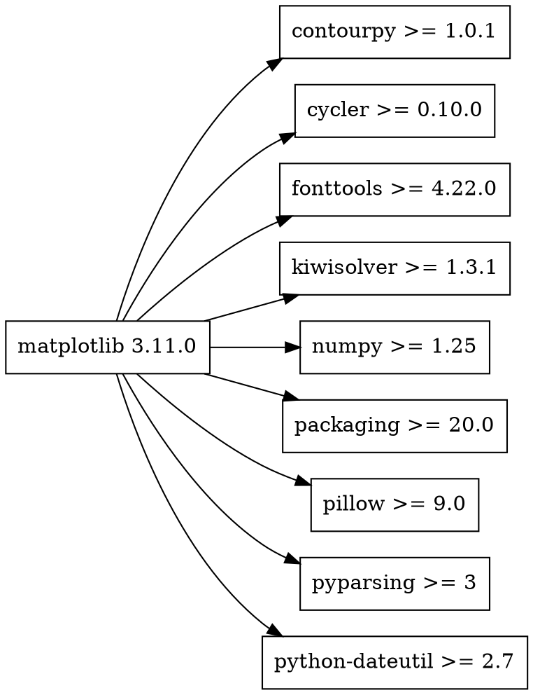
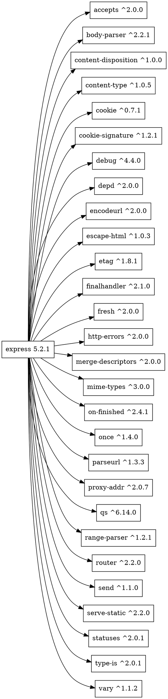

# Практическое занятие №2. Менеджеры пакетов

## Задача 1

```bash
python3 -m pip show matplotlib
python3 -m pip show -f matplotlib
```

```bash
python3 - <<'PY'
from importlib.metadata import metadata

info = metadata("matplotlib")

for field in ("Name", "Version", "Summary", "Requires-Python", "License"):
    print(f"{field}: {info.get(field)}")

print("Dependencies:")
for dependency in info.get_all("Requires-Dist") or []:
    print(dependency)
PY
```

```bash
git clone --depth 1 --branch v3.11.0 https://github.com/matplotlib/matplotlib.git
```

## Задача 2

```bash
npm view express
npm view express --json
npm view express name version description license repository engines dependencies
```

```bash
git clone --depth 1 --branch 5.2.1 https://github.com/expressjs/express.git
```

```bash
curl -LO https://registry.npmjs.org/express/-/express-5.2.1.tgz
tar -xzf express-5.2.1.tgz
cat package/package.json
```

## Задача 3

`matplotlib.dot`:



```bash
dot -Tpng matplotlib.dot -o matplotlib_dependencies.png
```

`express.dot`:



```bash
dot -Tpng express.dot -o express_dependencies.png
```

## Задача 4

```minizinc
include "alldifferent.mzn";

array[1..6] of var 0..9: digit;
var 0..27: sum3;

constraint digit[1] > 0;
constraint all_different(digit);
constraint digit[1] + digit[2] + digit[3] = sum3;
constraint digit[4] + digit[5] + digit[6] = sum3;

solve minimize sum3;

output ["ticket = "] ++
       [show(digit[i]) | i in 1..6] ++
       ["\nsum = ", show(sum3), "\n"];
```

```text
ticket = 134026
sum = 8
```

## Задача 5

```minizinc
array[1..6] of string: menu_version =
    ["1.0.0", "1.1.0", "1.2.0", "1.3.0", "1.4.0", "1.5.0"];
array[1..5] of string: dropdown_version =
    ["1.8.0", "2.0.0", "2.1.0", "2.2.0", "2.3.0"];
array[1..2] of string: icons_version = ["1.0.0", "2.0.0"];

var 1..6: menu;
var 1..5: dropdown;
var 1..2: icons;

constraint icons = 1;
constraint (menu >= 2) -> (dropdown >= 2);
constraint (menu = 1) -> (dropdown = 1);
constraint (dropdown >= 2) -> (icons = 2);
constraint (dropdown = 1) -> (icons = 1);

solve maximize 100 * menu + 10 * dropdown + icons;

output [
    "menu = " ++ menu_version[fix(menu)] ++ "\n",
    "dropdown = " ++ dropdown_version[fix(dropdown)] ++ "\n",
    "icons = " ++ icons_version[fix(icons)] ++ "\n"
];
```

```text
menu = 1.0.0
dropdown = 1.8.0
icons = 1.0.0
```

## Задача 6

```minizinc
array[1..2] of string: foo_version = ["1.0.0", "1.1.0"];
array[1..2] of string: target_version = ["1.0.0", "2.0.0"];

var 1..2: foo;
var 1..2: target;
var 0..1: left;
var 0..1: right;
var 0..2: shared;

constraint target = 2;
constraint (foo = 2) -> (left = 1 /\ right = 1);
constraint (foo = 1) -> (left = 0 /\ right = 0 /\ shared = 0);
constraint (left = 1) -> (shared >= 1);
constraint (right = 1) -> (shared = 1);
constraint (shared = 1) -> (target = 1);

solve maximize foo;

output [
    "root = 1.0.0\n",
    "foo = " ++ foo_version[fix(foo)] ++ "\n",
    "target = " ++ target_version[fix(target)] ++ "\n",
    "left = " ++ (if fix(left) = 0 then "not installed" else "1.0.0" endif) ++ "\n",
    "right = " ++ (if fix(right) = 0 then "not installed" else "1.0.0" endif) ++ "\n",
    "shared = " ++ (
        if fix(shared) = 0 then "not installed"
        elseif fix(shared) = 1 then "1.0.0"
        else "2.0.0"
        endif
    ) ++ "\n"
];
```

```text
root = 1.0.0
foo = 1.0.0
target = 2.0.0
left = not installed
right = not installed
shared = not installed
```

## Задача 7

```python
from z3 import Implies, Int, Optimize, Or, sat


packages = {
    "root": {
        "1.0.0": {"foo": "^1.0.0", "target": "^2.0.0"},
    },
    "foo": {
        "1.0.0": {},
        "1.1.0": {"left": "^1.0.0", "right": "^1.0.0"},
    },
    "left": {
        "1.0.0": {"shared": ">=1.0.0"},
    },
    "right": {
        "1.0.0": {"shared": "<2.0.0"},
    },
    "shared": {
        "1.0.0": {"target": "^1.0.0"},
        "2.0.0": {},
    },
    "target": {
        "1.0.0": {},
        "2.0.0": {},
    },
}


def version_tuple(version):
    return tuple(map(int, version.split(".")))


def satisfies(version, requirement):
    current = version_tuple(version)

    if requirement.startswith("^"):
        lower = version_tuple(requirement[1:])
        if lower[0] > 0:
            upper = (lower[0] + 1, 0, 0)
        else:
            upper = (0, lower[1] + 1, 0)
        return lower <= current < upper

    result = True
    for condition in requirement.split():
        if condition.startswith(">="):
            result = result and current >= version_tuple(condition[2:])
        elif condition.startswith("<"):
            result = result and current < version_tuple(condition[1:])
        else:
            result = result and current == version_tuple(condition)
    return result


versions = {
    name: sorted(items, key=version_tuple)
    for name, items in packages.items()
}

choice = {name: Int(name) for name in packages}
solver = Optimize()
required_by = {name: [] for name in packages}

for name, items in versions.items():
    solver.add(choice[name] >= 0, choice[name] <= len(items))

solver.add(choice["root"] == versions["root"].index("1.0.0") + 1)

for package, package_versions in versions.items():
    for index, version in enumerate(package_versions, start=1):
        selected = choice[package] == index

        for dependency, requirement in packages[package][version].items():
            allowed = [
                choice[dependency] == dependency_index
                for dependency_index, dependency_version
                in enumerate(versions[dependency], start=1)
                if satisfies(dependency_version, requirement)
            ]

            solver.add(Implies(selected, Or(allowed)))
            required_by[dependency].append(selected)

for package in packages:
    if package != "root":
        solver.add((choice[package] != 0) == Or(required_by[package]))

for package in sorted(packages):
    solver.maximize(choice[package])

if solver.check() == sat:
    model = solver.model()
    for package in packages:
        selected = model.eval(choice[package]).as_long()
        if selected != 0:
            print(f"{package} {versions[package][selected - 1]}")
else:
    print("Совместимого набора версий нет")
```

```bash
python3 -m pip install z3-solver
python3 task7.py
```

```text
root 1.0.0
foo 1.0.0
target 2.0.0
```
